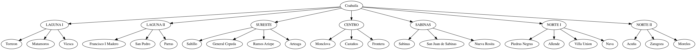
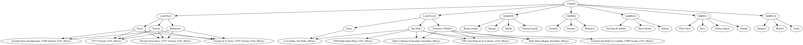
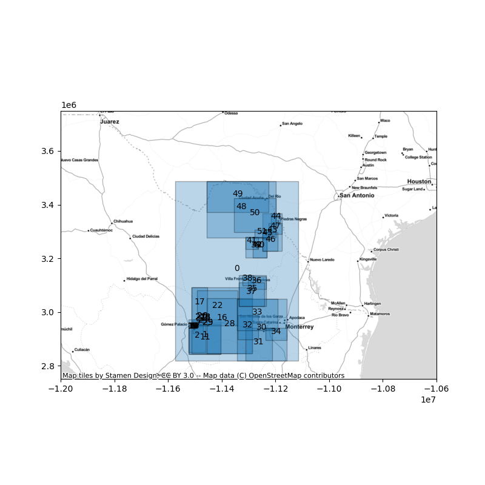

# gravesmx

clandestine graves spatialization


The running code developed until now is in `espacializar_hallazgos.py` where the main call looks like this:


```
    REGIONS_URI = './data/bounds_coahuila.tsv'
    FOSAS_URI = './data/OperativosdeCampo2017-2020.xlsx'

    geodf = build_geodf(REGIONS_URI)

    ### creating a geographic tree from geo-data frame
    geotree = build_geotree(geodf)

    ### initial tree
    RenderTreeGraph(geotree).to_picture("outputs/inittree.png")

    ### loading findings data
    geotree.load_findings(FOSAS_URI)

    ### query geoparser ws with findings data
    geotree.geoparse_findings()

    ### final tree
    RenderTreeGraph(geotree).to_picture("outputs/finaltree.png")

    ### save new data
    tree_df = tree_as_df(geotree)
    tree_df.to_file('outputs/spatial_data.json', driver="GeoJSON")

    ### save map
    mapplot(tree_df)

```

## outputs

The execution of main will produce many outputs saved in `outputs` dir.
spatial_data.json will contain the final spatialized data.


```
{
"type": "FeatureCollection",
"crs": { "type": "name", "properties": { "name": "urn:ogc:def:crs:OGC:1.3:CRS84" } },
  "features": [
  { "type": "Feature", "properties": { "parent": "root", "name": "Coahuila" }, "geometry": { "type": "Polygon", "coordinates": [ [ [ -99.8431198, 24.54268406 ], [ -99.8431198, 29.88002429 ], [ -103.9600019, 29.88002429 ], [ -103.9600019, 24.54268406 ], [ -99.8431198, 24.54268406 ] ] ] } },
  { "type": "Feature", "properties": { "parent": "Coahuila", "name": "LAGUNA I" }, "geometry": { "type": "Polygon", "coordinates": [ [ [ -102.4467635, 24.73977397 ], [ -102.4467635, 25.77617708 ], [ -103.5109366, 25.77617708 ], [ -103.5109366, 24.73977397 ], [ -102.4467635, 24.73977397 ] ] ] } },
  { "type": "Feature", "properties": { "parent": "LAGUNA I", "name": "Torreon" }, "geometry": { "type": "Polygon", "coordinates": [ [ [ -102.9567947, 24.79310036 ], [ -102.9567947, 25.69138718 ], [ -103.5109482, 25.69138718 ], [ -103.5109482, 24.79310036 ], [ -102.9567947, 24.79310036 ] ] ] } },
  { "type": "Feature", "properties": { "parent": "Torreon", "name": "Avenida Sierra del Quemado, 27296 Torreón, COA, México" }, "geometry": { "type": "Polygon", "coordinates": [ [ [ -103.374122, 25.5067477 ], [ -103.374122, 25.5068563 ], [ -103.3749491, 25.5068563 ], [ -103.3749491, 25.5067477 ], [ -103.374122, 25.5067477 ] ] ] } },
  { "type": "Feature", "properties": { "parent": "Torreon", "name": "27277 Torreón, COA, México" }, "geometry": { "type": "Polygon", "coordinates": [ [ [ -103.3082027, 25.4827869 ], [ -103.3082027, 25.5227869 ], [ -103.3482027, 25.5227869 ], [ -103.3482027, 25.4827869 ], [ -103.3082027, 25.4827869 ] ] ] } },
  { "type": "Feature", "properties": { "parent": "Torreon", "name": "Privada Tierra Nova, 27277 Torreón, COA, México" }, "geometry": { "type": "Polygon", "coordinates": [ [ [ -103.3504231, 25.5051965 ], [ -103.3504231, 25.5055703 ], [ -103.3511314, 25.5055703 ], [ -103.3511314, 25.5051965 ], [ -103.3504231, 25.5051965 ] ] ] } },
  { "type": "Feature", "properties": { "parent": "Torreon", "name": "Circuito de la Tierra, 27297 Torreón, COA, México" }, "geometry": { "type": "Polygon", "coordinates": [ [ [ -103.3606897, 25.5105414 ], [ -103.3606897, 25.5121236 ], [ -103.3616224, 25.5121236 ], [ -103.3616224, 25.5105414 ], [ -103.3606897, 25.5105414 ] ] ] } },
  { "type": "Feature", "properties": { "parent": "LAGUNA I", "name": "Matamoros" }, "geometry": { "type": "Polygon", "coordinates": [ [ [ -103.0304565, 25.37107277 ], [ -103.0304565, 25.77618027 ], [ -103.3661575, 25.77618027 ], [ -103.3661575, 25.37107277 ], [ -103.0304565, 25.37107277 ] ] ] } },
  { "type": "Feature", "properties": { "parent": "Matamoros", "name": "27277 Torreón, COA, México" }, "geometry": { "type": "Polygon", "coordinates": [ [ [ -103.3082027, 25.4827869 ], [ -103.3082027, 25.5227869 ], [ -103.3482027, 25.5227869 ], [ -103.3482027, 25.4827869 ], [ -103.3082027, 25.4827869 ] ] ] } },
  { "type": "Feature", "properties": { "parent": "Matamoros", "name": "Privada Tierra Nova, 27277 Torreón, COA, México" }, "geometry": { "type": "Polygon", "coordinates": [ [ [ -103.3504231, 25.5051965 ], [ -103.3504231, 25.5055703 ], [ -103.3511314, 25.5055703 ], [ -103.3511314, 25.5051965 ], [ -103.3504231, 25.5051965 ] ] ] } },
  { "type": "Feature", "properties": { "parent": "Matamoros", "name": "Circuito de la Tierra, 27297 Torreón, COA, México" }, "geometry": { "type": "Polygon", "coordinates": [ [ [ -103.3606897, 25.5105414 ], [ -103.3606897, 25.5121236 ], [ -103.3616224, 25.5121236 ], [ -103.3616224, 25.5105414 ], [ -103.3606897, 25.5105414 ] ] ] } },
  { "type": "Feature", "properties": { "parent": "LAGUNA I", "name": "Viesca" }, "geometry": { "type": "Polygon", "coordinates": [ [ [ -102.446762099999987, 24.73977089 ], [ -102.446762099999987, 25.63485527 ], [ -103.4935532, 25.63485527 ], [ -103.4935532, 24.73977089 ], [ -102.446762099999987, 24.73977089 ] ] ] } },
  { "type": "Feature", "properties": { "parent": "Viesca", "name": "Avenida Sierra del Quemado, 27296 Torreón, COA, México" }, "geometry": { "type": "Polygon", "coordinates": [ [ [ -103.374122, 25.5067477 ], [ -103.374122, 25.5068563 ], [ -103.3749491, 25.5068563 ], [ -103.3749491, 25.5067477 ], [ -103.374122, 25.5067477 ] ] ] } },
  { "type": "Feature", "properties": { "parent": "Viesca", "name": "27277 Torreón, COA, México" }, "geometry": { "type": "Polygon", "coordinates": [ [ [ -103.3082027, 25.4827869 ], [ -103.3082027, 25.5227869 ], [ -103.3482027, 25.5227869 ], [ -103.3482027, 25.4827869 ], [ -103.3082027, 25.4827869 ] ] ] } },
  { "type": "Feature", "properties": { "parent": "Viesca", "name": "Privada Tierra Nova, 27277 Torreón, COA, México" }, "geometry": { "type": "Polygon", "coordinates": [ [ [ -103.3504231, 25.5051965 ], [ -103.3504231, 25.5055703 ], [ -103.3511314, 25.5055703 ], [ -103.3511314, 25.5051965 ], [ -103.3504231, 25.5051965 ] ] ] } },
  { "type": "Feature", "properties": { "parent": "Viesca", "name": "Circuito de la Tierra, 27297 Torreón, COA, México" }, "geometry": { "type": "Polygon", "coordinates": [ [ [ -103.3606897, 25.5105414 ], [ -103.3606897, 25.5121236 ], [ -103.3616224, 25.5121236 ], [ -103.3616224, 25.5105414 ], [ -103.3606897, 25.5105414 ] ] ] } },
  { "type": "Feature", "properties": { "parent": "Coahuila", "name": "LAGUNA II" }, "geometry": { "type": "Polygon", "coordinates": [ [ [ -101.379251900000014, 24.75439672 ], [ -101.379251900000014, 26.75409914 ], [ -103.415963799999986, 26.75409914 ], [ -103.415963799999986, 24.75439672 ], [ -101.379251900000014, 24.75439672 ] ] ] } },
  { "type": "Feature", "properties": { "parent": "LAGUNA II", "name": "Francisco I Madero" }, "geometry": { "type": "Polygon", "coordinates": [ [ [ -102.8796616, 25.70682907 ], [ -102.8796616, 26.75410271 ], [ -103.4159775, 26.75410271 ], [ -103.4159775, 25.70682907 ], [ -102.8796616, 25.70682907 ] ] ] } },
  { "type": "Feature", "properties": { "parent": "Francisco I Madero", "name": "27811 San Pedro de las Colonias, COA, México" }, "geometry": { "type": "Polygon", "coordinates": [ [ [ -102.9365963, 25.7641492 ], [ -102.9365963, 25.8041492 ], [ -102.9765963, 25.8041492 ], [ -102.9765963, 25.7641492 ], [ -102.9365963, 25.7641492 ] ] ] } },
  { "type": "Feature", "properties": { "parent": "Francisco I Madero", "name": "Carretera San Pedro-La Cuchilla, 27800 Tacuba, COA, México" }, "geometry": { "type": "Polygon", "coordinates": [ [ [ -102.9656267, 25.7399202 ], [ -102.9656267, 25.7432987 ], [ -102.967508, 25.7432987 ], [ -102.967508, 25.7399202 ], [ -102.9656267, 25.7399202 ] ] ] } },
  { "type": "Feature", "properties": { "parent": "Francisco I Madero", "name": "Ejido Flores Magón, San Pedro, México" }, "geometry": { "type": "Polygon", "coordinates": [ [ [ -103.03455, 25.8001187 ], [ -103.03455, 25.8401187 ], [ -103.07455, 25.8401187 ], [ -103.07455, 25.8001187 ], [ -103.03455, 25.8001187 ] ] ] } },
  { "type": "Feature", "properties": { "parent": "Francisco I Madero", "name": "Ejido La Rosita (Concordia), San Pedro, México" }, "geometry": { "type": "Polygon", "coordinates": [ [ [ -103.0751773, 25.739772 ], [ -103.0751773, 25.819772 ], [ -103.1551773, 25.819772 ], [ -103.1551773, 25.739772 ], [ -103.0751773, 25.739772 ] ] ] } },
  { "type": "Feature", "properties": { "parent": "LAGUNA II", "name": "San Pedro" }, "geometry": { "type": "Polygon", "coordinates": [ [ [ -101.8689728, 25.60061073 ], [ -101.8689728, 26.64840126 ], [ -103.2351074, 26.64840126 ], [ -103.2351074, 25.60061073 ], [ -101.8689728, 25.60061073 ] ] ] } },
  { "type": "Feature", "properties": { "parent": "San Pedro", "name": "27811 San Pedro de las Colonias, COA, México" }, "geometry": { "type": "Polygon", "coordinates": [ [ [ -102.9365963, 25.7641492 ], [ -102.9365963, 25.8041492 ], [ -102.9765963, 25.8041492 ], [ -102.9765963, 25.7641492 ], [ -102.9365963, 25.7641492 ] ] ] } },
  { "type": "Feature", "properties": { "parent": "San Pedro", "name": "27954 Ejido Santa Elena, COA, México" }, "geometry": { "type": "Polygon", "coordinates": [ [ [ -103.0093293, 25.6718591 ], [ -103.0093293, 25.7118591 ], [ -103.0493293, 25.7118591 ], [ -103.0493293, 25.6718591 ], [ -103.0093293, 25.6718591 ] ] ] } },
  { "type": "Feature", "properties": { "parent": "San Pedro", "name": "La Cuchilla, San Pedro, México" }, "geometry": { "type": "Polygon", "coordinates": [ [ [ -102.8552546, 25.6050286 ], [ -102.8552546, 25.6450286 ], [ -102.8952546, 25.6450286 ], [ -102.8952546, 25.6050286 ], [ -102.8552546, 25.6050286 ] ] ] } },
  { "type": "Feature", "properties": { "parent": "San Pedro", "name": "Ejido Flores Magón, San Pedro, México" }, "geometry": { "type": "Polygon", "coordinates": [ [ [ -103.03455, 25.8001187 ], [ -103.03455, 25.8401187 ], [ -103.07455, 25.8401187 ], [ -103.07455, 25.8001187 ], [ -103.03455, 25.8001187 ] ] ] } },
  { "type": "Feature", "properties": { "parent": "San Pedro", "name": "Ejido La Rosita (Concordia), San Pedro, México" }, "geometry": { "type": "Polygon", "coordinates": [ [ [ -103.0751773, 25.739772 ], [ -103.0751773, 25.819772 ], [ -103.1551773, 25.819772 ], [ -103.1551773, 25.739772 ], [ -103.0751773, 25.739772 ] ] ] } },
  { "type": "Feature", "properties": { "parent": "LAGUNA II", "name": "Parras" }, "geometry": { "type": "Polygon", "coordinates": [ [ [ -101.3792496, 24.75439644 ], [ -101.3792496, 26.421772 ], [ -102.9047165, 26.421772 ], [ -102.9047165, 24.75439644 ], [ -101.3792496, 24.75439644 ] ] ] } },
  { "type": "Feature", "properties": { "parent": "Parras", "name": "La Cuchilla, San Pedro, México" }, "geometry": { "type": "Polygon", "coordinates": [ [ [ -102.8552546, 25.6050286 ], [ -102.8552546, 25.6450286 ], [ -102.8952546, 25.6450286 ], [ -102.8952546, 25.6050286 ], [ -102.8552546, 25.6050286 ] ] ] } },
  { "type": "Feature", "properties": { "parent": "Coahuila", "name": "SURESTE" }, "geometry": { "type": "Polygon", "coordinates": [ [ [ -100.2295756, 24.54268406 ], [ -100.2295756, 26.39715318 ], [ -101.8948525, 26.39715318 ], [ -101.8948525, 24.54268406 ], [ -100.2295756, 24.54268406 ] ] ] } },
  { "type": "Feature", "properties": { "parent": "SURESTE", "name": "Saltillo" }, "geometry": { "type": "Polygon", "coordinates": [ [ [ -100.7274933, 24.54268074 ], [ -100.7274933, 25.5229187 ], [ -101.6209946, 25.5229187 ], [ -101.6209946, 24.54268074 ], [ -100.7274933, 24.54268074 ] ] ] } },
  { "type": "Feature", "properties": { "parent": "SURESTE", "name": "General Cepeda" }, "geometry": { "type": "Polygon", "coordinates": [ [ [ -101.1836548, 25.17666817 ], [ -101.1836548, 25.91145134 ], [ -101.8733749, 25.91145134 ], [ -101.8733749, 25.17666817 ], [ -101.1836548, 25.17666817 ] ] ] } },
  { "type": "Feature", "properties": { "parent": "SURESTE", "name": "Ramos Arizpe" }, "geometry": { "type": "Polygon", "coordinates": [ [ [ -100.529686, 25.45014572 ], [ -100.529686, 26.39715385 ], [ -101.894866900000011, 26.39715385 ], [ -101.894866900000011, 25.45014572 ], [ -100.529686, 25.45014572 ] ] ] } },
  { "type": "Feature", "properties": { "parent": "SURESTE", "name": "Arteaga" }, "geometry": { "type": "Polygon", "coordinates": [ [ [ -100.22956090000001, 25.15325928 ], [ -100.22956090000001, 25.53583908 ], [ -100.95121, 25.53583908 ], [ -100.95121, 25.15325928 ], [ -100.22956090000001, 25.15325928 ] ] ] } },
  { "type": "Feature", "properties": { "parent": "Coahuila", "name": "CENTRO" }, "geometry": { "type": "Polygon", "coordinates": [ [ [ -100.916739, 26.18521409 ], [ -100.916739, 27.10073248 ], [ -101.838135200000011, 27.10073248 ], [ -101.838135200000011, 26.18521409 ], [ -100.916739, 26.18521409 ] ] ] } },
  { "type": "Feature", "properties": { "parent": "CENTRO", "name": "Monclova" }, "geometry": { "type": "Polygon", "coordinates": [ [ [ -100.9167252, 26.69766998 ], [ -100.9167252, 27.06407166 ], [ -101.5293045, 27.06407166 ], [ -101.5293045, 26.69766998 ], [ -100.9167252, 26.69766998 ] ] ] } },
  { "type": "Feature", "properties": { "parent": "CENTRO", "name": "Castaños" }, "geometry": { "type": "Polygon", "coordinates": [ [ [ -100.983757, 26.18521118 ], [ -100.983757, 26.89212227 ], [ -101.83815, 26.89212227 ], [ -101.83815, 26.18521118 ], [ -100.983757, 26.18521118 ] ] ] } },
  { "type": "Feature", "properties": { "parent": "CENTRO", "name": "Frontera" }, "geometry": { "type": "Polygon", "coordinates": [ [ [ -101.348793, 26.80668831 ], [ -101.348793, 27.1007328 ], [ -101.7169876, 27.1007328 ], [ -101.7169876, 26.80668831 ], [ -101.348793, 26.80668831 ] ] ] } },
  { "type": "Feature", "properties": { "parent": "Coahuila", "name": "SABINAS" }, "geometry": { "type": "Polygon", "coordinates": [ [ [ -100.9018541, 27.63666089 ], [ -100.9018541, 28.24413249 ], [ -101.6135633, 28.24413249 ], [ -101.6135633, 27.63666089 ], [ -100.9018541, 27.63666089 ] ] ] } },
  { "type": "Feature", "properties": { "parent": "SABINAS", "name": "Sabinas" }, "geometry": { "type": "Polygon", "coordinates": [ [ [ -100.9018402, 27.63665771 ], [ -100.9018402, 28.244133 ], [ -101.3666763, 28.244133 ], [ -101.3666763, 27.63665771 ], [ -100.9018402, 27.63665771 ] ] ] } },
  { "type": "Feature", "properties": { "parent": "SABINAS", "name": "San Juan de Sabinas" }, "geometry": { "type": "Polygon", "coordinates": [ [ [ -101.1897583, 27.8790226 ], [ -101.1897583, 28.23955154 ], [ -101.6135635, 28.23955154 ], [ -101.6135635, 27.8790226 ], [ -101.1897583, 27.8790226 ] ] ] } },
  { "type": "Feature", "properties": { "parent": "SABINAS", "name": "Nueva Rosita" }, "geometry": { "type": "Polygon", "coordinates": [ [ [ -101.1939079, 27.91203817 ], [ -101.1939079, 27.95526689 ], [ -101.2519748, 27.95526689 ], [ -101.2519748, 27.91203817 ], [ -101.1939079, 27.91203817 ] ] ] } },
  { "type": "Feature", "properties": { "parent": "Coahuila", "name": "NORTE I" }, "geometry": { "type": "Polygon", "coordinates": [ [ [ -100.3968043, 27.82143862 ], [ -100.3968043, 28.9407502 ], [ -101.0346931, 28.9407502 ], [ -101.0346931, 27.82143862 ], [ -100.3968043, 27.82143862 ] ] ] } },
  { "type": "Feature", "properties": { "parent": "NORTE I", "name": "Piedras Negras" }, "geometry": { "type": "Polygon", "coordinates": [ [ [ -100.4454193, 28.60662651 ], [ -100.4454193, 28.94075394 ], [ -100.7656021, 28.94075394 ], [ -100.7656021, 28.60662651 ], [ -100.4454193, 28.60662651 ] ] ] } },
  { "type": "Feature", "properties": { "parent": "NORTE I", "name": "Allende" }, "geometry": { "type": "Polygon", "coordinates": [ [ [ -100.7317657, 28.19050026 ], [ -100.7317657, 28.38165474 ], [ -101.0347061, 28.38165474 ], [ -101.0347061, 28.19050026 ], [ -100.7317657, 28.19050026 ] ] ] } },
  { "type": "Feature", "properties": { "parent": "NORTE I", "name": "Villa Union" }, "geometry": { "type": "Polygon", "coordinates": [ [ [ -100.5381088, 27.82143784 ], [ -100.5381088, 28.37746811 ], [ -101.0330353, 28.37746811 ], [ -101.0330353, 27.82143784 ], [ -100.5381088, 27.82143784 ] ] ] } },
  { "type": "Feature", "properties": { "parent": "NORTE I", "name": "Nava" }, "geometry": { "type": "Polygon", "coordinates": [ [ [ -100.3967896, 28.33309555 ], [ -100.3967896, 28.65101814 ], [ -100.8393173, 28.65101814 ], [ -100.8393173, 28.33309555 ], [ -100.3967896, 28.33309555 ] ] ] } },
  { "type": "Feature", "properties": { "parent": "Coahuila", "name": "NORTE II" }, "geometry": { "type": "Polygon", "coordinates": [ [ [ -100.6036667, 28.22239854 ], [ -100.6036667, 29.88002429 ], [ -102.9063498, 29.88002429 ], [ -102.9063498, 28.22239854 ], [ -100.6036667, 28.22239854 ] ] ] } },
  { "type": "Feature", "properties": { "parent": "NORTE II", "name": "Acuña" }, "geometry": { "type": "Polygon", "coordinates": [ [ [ -100.8488464, 28.97006989 ], [ -100.8488464, 29.88002777 ], [ -102.906364400000015, 29.88002777 ], [ -102.906364400000015, 28.97006989 ], [ -100.8488464, 28.97006989 ] ] ] } },
  { "type": "Feature", "properties": { "parent": "NORTE II", "name": "Zaragoza" }, "geometry": { "type": "Polygon", "coordinates": [ [ [ -100.603653, 28.37646103 ], [ -100.603653, 29.37184525 ], [ -101.9972153, 29.37184525 ], [ -101.9972153, 28.37646103 ], [ -100.603653, 28.37646103 ] ] ] } },
  { "type": "Feature", "properties": { "parent": "NORTE II", "name": "Morelos" }, "geometry": { "type": "Polygon", "coordinates": [ [ [ -100.8082504, 28.22239494 ], [ -100.8082504, 28.45348358 ], [ -101.3042297, 28.45348358 ], [ -101.3042297, 28.22239494 ], [ -100.8082504, 28.22239494 ] ] ] } }
  ]
}

```

The inital Geospatial Tree:




The final Geospatial Tree:




There is also a map tile representation of the final spatialization (work in progress):




## log file

By the moment, the best for logging the execution is using the following command:

```
$python espacializar_hallazgos.py > outputs/log.txt

```

This will store the important events during run time. For example:

```
q>ejido la luz
bound name>Villa Union
bound coords>-101.0330353,27.82143784,-100.5381088,28.37746811
ejido la luz
[
  {
    "annotations": {
      "DMS": {
        "lat": "28° 8' 60.00000'' N",
        "lng": "100° 43' 59.98800'' W"
      },
      "MGRS": "14RLS2979615033",
      "Maidenhead": "DL98pd26aa",
      "Mercator": {
        "x": -11213583.002,
        "y": 3247744.568
      },
      "OSM": {
        "note_url": "https://www.openstreetmap.org/note/new#map=16/28.15000/-100.73333&layers=N",
        "url": "https://www.openstreetmap.org/?mlat=28.15000&mlon=-100.73333#map=16/28.15000/-100.73333"
      },
      "UN_M49": {
        "regions": {
          "AMERICAS": "019",
          "CENTRAL_AMERICA": "013",
          "LATIN_AMERICA": "419",
          "MX": "484",
          "WORLD": "001"
        },
        "statistical_groupings": [
          "LEDC"
        ]
      },
      "callingcode": 52,
      "currency": {
        "alternate_symbols": [
          "MEX$"
        ],
        "decimal_mark": ".",
        "disambiguate_symbol": "MEX$",
        "html_entity": "$",
        "iso_code": "MXN",
        "iso_numeric": "484",
        "name": "Mexican Peso",
        "smallest_denomination": 5,
        "subunit": "Centavo",
        "subunit_to_unit": 100,
        "symbol": "$",
        "symbol_first": 1,
        "thousands_separator": ","
      },
      "flag": "🇲🇽",
      "geohash": "9v025u81xk34f3uuq39m",
      "qibla": 41.81,
      "roadinfo": {
        "drive_on": "right",
        "speed_in": "km/h"
      },
      "sun": {
        "rise": {
          "apparent": 1602074400,
          "astronomical": 1602069780,
          "civil": 1602073020,
          "nautical": 1602071400
        },
        "set": {
          "apparent": 1602030000,
          "astronomical": 1602034680,
          "civil": 1602031440,
          "nautical": 1602033060
        }
      },
      "timezone": {
        "name": "America/Monterrey",
        "now_in_dst": 1,
        "offset_sec": -18000,
        "offset_string": "-0500",
        "short_name": "CDT"
      },
      "what3words": {
        "words": "cumbre.pensaban.desemboca"
      }
    },
    "components": {
      "ISO_3166-1_alpha-2": "MX",
      "ISO_3166-1_alpha-3": "MEX",
      "_category": "place",
      "_type": "city",
      "continent": "North America",
      "country": "México",
      "country_code": "mx",
      "state": "Coahuila de Zaragoza",
      "state_code": "COA",
      "town": "Ejido La Luz"
    },
    "confidence": 9,
    "formatted": "Ejido La Luz, Coahuila de Zaragoza, México",
    "geometry": {
      "lat": 28.15,
      "lng": -100.73333
    }
  }
]
...

```

## Dependencies

For Python 3 dependencies see `requirements.txt`. A quick installation with pip is recommended.

```
pip3 install  -r requirements.txt
```

In addition to the Python 3 libraries it is required to install [graphviz](http://www.graphviz.org/).

Mac:

```
$ sudo port install graphviz

```
linux:

```
$ sudo apt install graphviz
```


## Built With

* [Geoparse MX](http://geoparsing.geoint.mx/mx/) - geoparsing in spanish.
* [OpenCage Geocoder](https://opencagedata.com/) - geocoding.
* [GeoPandas](https://geopandas.org/).
* [Shapely](https://pypi.org/project/Shapely/).
* [Anytree](https://anytree.readthedocs.io/en/latest/).

## Authors

**Alejandro Molina-Villegas**

* [CONACyT-CentroGeo](https://www.centrogeo.org.mx/areas-profile/amolina)

* [dblp](https://dblp.uni-trier.de/pers/hd/m/Molina=Villegas:Alejandro)
* [orcid](https://orcid.org/0000-0001-9398-8844)

**José Luis Silván**

* [CONACyT-CentroGeo](https://www.centrogeo.org.mx/areas-profile/jsilvan)


See also the list of [contributors](contributors) who participate in this project.

## Institutions

  * [CentroGeo](https://www.centrogeo.org.mx/) - Centro de Investigación en Ciencias de Información Geoespacial.

<!-- ## License

This project is licensed under the MIT License - see the [LICENSE](docs/LICENSE) file for details. 

Permission is hereby granted, free of charge, to any person obtaining a copy
of this software and associated documentation files (the "Software"), to deal
in the Software without restriction, including without limitation the rights
to use, copy, modify, merge, publish, distribute, sublicense, and/or sell
copies of the Software, and to permit persons to whom the Software is
furnished to do so, subject to the following conditions:

The above copyright notice and this permission notice shall be included in all
copies or substantial portions of the Software.

THE SOFTWARE IS PROVIDED "AS IS", WITHOUT WARRANTY OF ANY KIND, EXPRESS OR
IMPLIED, INCLUDING BUT NOT LIMITED TO THE WARRANTIES OF MERCHANTABILITY,
FITNESS FOR A PARTICULAR PURPOSE AND NONINFRINGEMENT. IN NO EVENT SHALL THE
AUTHORS OR COPYRIGHT HOLDERS BE LIABLE FOR ANY CLAIM, DAMAGES OR OTHER
LIABILITY, WHETHER IN AN ACTION OF CONTRACT, TORT OR OTHERWISE, ARISING FROM,
OUT OF OR IN CONNECTION WITH THE SOFTWARE OR THE USE OR OTHER DEALINGS IN THE
SOFTWARE.
 -->


